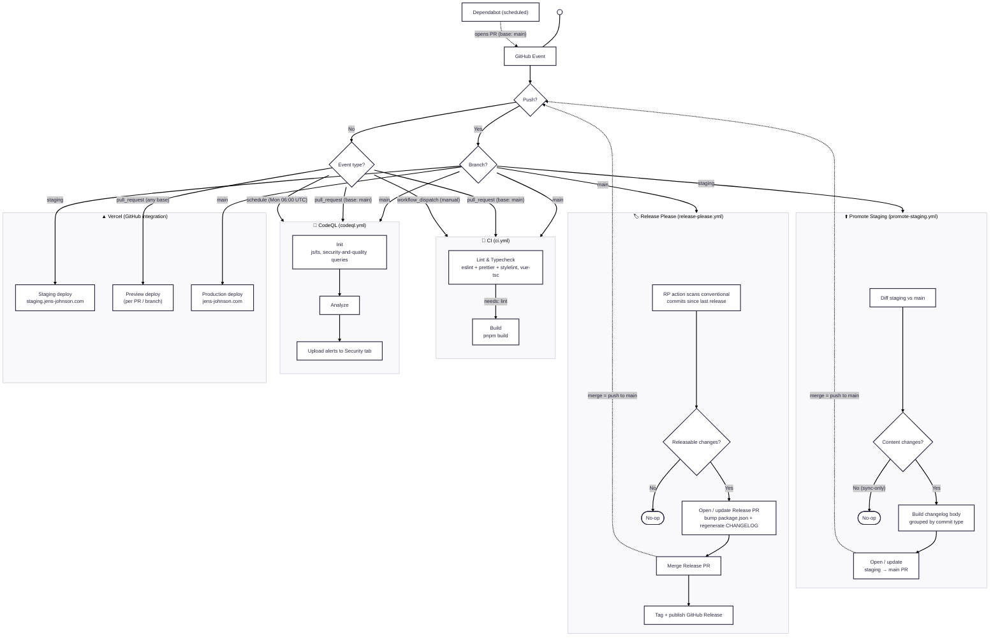

# jj-dev: CI Architecture and Implementation

How GitHub events drive the project's automation. Continuous integration, security scanning, release
management, and promotion run as **GitHub Actions** workflows under [`.github/workflows/`](../../.github/workflows);
deployments are handled by the **Vercel** Git integration. This doc maps each event to the action it triggers and
describes what that action does.

## Branch and environment model

Three permanent branches map to three environments. Feature branches PR into `staging` for review; once merged, an
automated promotion PR ships `staging` to `main` (production).

| Branch    | Environment | URL                      |
| --------- | ----------- | ------------------------ |
| `main`    | Production  | jens-johnson.com         |
| `staging` | Pre-prod    | staging.jens-johnson.com |
| `feat/*`  | Preview     | per-PR Vercel preview    |

## Event to action flow

## GitHub Actions workflows

### 🔀 CI ([`ci.yml`](../../.github/workflows/ci.yml))

**Triggers:** `push` to `main`, `pull_request` targeting `main`, and manual `workflow_dispatch`. A concurrency group
keyed on the ref cancels in-progress runs when new commits arrive, so only the latest commit on a branch is verified.

**Jobs** (pnpm with a frozen lockfile, Node read from `.nvmrc`):

1. **Lint, Typecheck & Test** runs `pnpm lint` (eslint + prettier + stylelint in parallel), then `pnpm typecheck` (vue-tsc), then `pnpm test` (vitest).
2. **Build** runs `pnpm build`; it declares `needs: [lint]`, so it only runs once lint and typecheck pass.

This mirrors the local `pnpm check` gate (lint to typecheck to test to build).

> **Base-branch nuance:** the `pull_request` trigger is scoped to base `main`, so CI gates PRs **into `main`** (the
> `staging` to `main` promotion PR, plus any direct PR to `main`). Feature PRs into `staging` are validated through
> their Vercel preview and locally, not by this workflow.

### 🔐 CodeQL ([`codeql.yml`](../../.github/workflows/codeql.yml))

**Triggers:** `push` to `main`, `pull_request` targeting `main`, and a weekly `schedule` (Mondays at 06:00 UTC).

**Job:** initializes CodeQL for the `javascript-typescript` language with the `security-and-quality` query suite,
analyzes the codebase, and uploads findings to the repository's Security tab (`security-events: write`). The weekly
cron catches newly disclosed advisories even when no code changed.

### ⬆️ Promote Staging ([`promote-staging.yml`](../../.github/workflows/promote-staging.yml))

**Trigger:** `push` to `staging`.

**What it does:**

1. Compares `staging` against `main` by **content diff**, not commit count. After a sync merge (`git merge main` on
   `staging`), `staging` can be one commit ahead with zero content difference; this guard skips opening a no-op PR.
2. If there are real changes, it builds a PR body that lists every commit since the last promotion grouped by
   conventional-commit type (Features, Fixes, Refactors, and so on).
3. Opens (or updates) a single `staging → main` pull request titled `release: promote staging → main`.

**`PROMOTE_PAT` secret:** the workflow prefers a fine-grained PAT (`PROMOTE_PAT`) and falls back to `GITHUB_TOKEN`.
The PAT is what lets the auto-opened PR trigger downstream checks (CI, CodeQL); GitHub suppresses downstream
workflow triggers for actions taken with the default `GITHUB_TOKEN` to prevent recursion. The repo setting
"Allow GitHub Actions to create and approve pull requests" must also be enabled.

> **Merge the promotion PR with a merge commit, never squash.** Squashing collapses every staging commit into one
> commit whose body re-lists those messages; because the originals survive on `staging` across the sync-back, each
> later promotion re-lists them and Release Please emits a duplicate changelog entry per promotion. A merge commit
> lands each commit with its original SHA, which Release Please dedupes. See the Release Please section below.

### 🏷️ Release Please ([`release-please.yml`](../../.github/workflows/release-please.yml))

**Trigger:** `push` to `main`.

**What it does:** the `googleapis/release-please-action` scans conventional commits since the last release and
maintains a standing **Release PR** that bumps the version in `package.json` and regenerates `CHANGELOG.md`. Merging
that Release PR tags the release and publishes a GitHub Release. If there are no releasable commits, it no-ops.

**Config:**

- [`release-please-config.json`](../../release-please-config.json) sets `release-type: node` and the
  `changelog-sections` (which commit types appear under which heading, e.g. `feat` to "✨ Features").
- [`.release-please-manifest.json`](../../.release-please-manifest.json) tracks the current released version.
- Uses `PROMOTE_PAT` (falling back to `GITHUB_TOKEN`) for the same downstream-trigger reason as the promotion flow.

Because merging the Release PR is itself a `push` to `main`, the workflow re-runs and settles to a no-op until the
next releasable change.

### 🟢 Node LTS Watch ([`node-lts-watch.yml`](../../.github/workflows/node-lts-watch.yml))

**Trigger:** weekly cron (Mondays 15:00 UTC) + `workflow_dispatch`.

**What it does:** runs [`scripts/shell/check-node-lts.sh`](../../scripts/shell/check-node-lts.sh) to compare the
[`.nvmrc`](../../.nvmrc) pin against the newest Node LTS from the nodejs.org release index. A stale pin opens a
single `node-lts`-labeled issue with a bump checklist; once the pin catches up, the next run closes it
automatically. This replaces any shell-entry LTS checking, which the direnv environment deliberately avoids (no
network calls on `cd`). The workflow and script are copied canon from the
[style-guide repo](https://github.com/jens-johnson/jens-johnson).

## Vercel deployments

Deployments are handled by the **Vercel Git integration** (the Vercel GitHub App), not by a workflow file in this
repo. [`vercel.json`](../../vercel.json) sets `framework: null` because the build uses Nuxt's **Nitro Vercel preset**
(Build Output API) rather than a Vercel framework preset. Content-driven routes are prerendered to static HTML at
build time (see [`nuxt.config.ts`](../../nuxt.config.ts)); live data (substrate metrics, the Strava card) is fetched
client-side so static pages still hydrate fresh.

Vercel reacts to the same Git events:

- **Every PR / branch** gets an isolated **preview deployment** with its own URL.
- **`staging`** publishes to the pre-prod domain (staging.jens-johnson.com).
- **`main`** publishes the **production** deployment (jens-johnson.com).

Dependabot PRs are configured to skip preview deploys (they only bump dependencies). The branch-to-environment and
domain mapping lives in the Vercel project settings, not in the repository.

## End-to-end: a change reaching production

1. Branch `feat/*` off `staging`, open a PR into `staging`. Vercel builds a **preview**; review against it.
2. Merge to `staging`. The push triggers **Promote Staging**, which opens/updates the `staging → main` PR, and
   Vercel updates the **staging** deployment.
3. The promotion PR (base `main`) runs **CI** and **CodeQL**. When green, **merge it with a merge commit**. That
   push to `main` triggers **CI**, **CodeQL**, **Release Please**, and the Vercel **production** deploy.
4. **Release Please** opens/updates the Release PR. Merge it to tag the version, publish the GitHub Release, and
   write the `CHANGELOG.md` entry.
5. Sync `staging` back to `main` (`git merge main` on `staging`) so the branches do not drift.

## Triggers at a glance

| Event                           | CI  | CodeQL | Promote Staging | Release Please | Vercel     |
| ------------------------------- | --- | ------ | --------------- | -------------- | ---------- |
| `push` to `main`                | ✅  | ✅     |                 | ✅             | Production |
| `push` to `staging`             |     |        | ✅              |                | Staging    |
| `pull_request` (base `main`)    | ✅  | ✅     |                 |                | Preview    |
| `pull_request` (base `staging`) |     |        |                 |                | Preview    |
| `schedule` (weekly)             |     | ✅     |                 |                |            |
| `workflow_dispatch`             | ✅  |        |                 |                |            |

## Operational notes

- **Merge commits, not squash, for promotion and release PRs** (keeps Release Please changelog entries unique).
- **`PROMOTE_PAT`** must be set for auto-opened PRs to run required checks; without it the promotion/release PRs
  open but their checks do not fire until a manual close/reopen.
- The local equivalent of the CI gate is **`pnpm check`** (lint to typecheck to test to build); run it before pushing.
- Git hooks ([`lefthook`](../../lefthook.yml)) run lint-staged on pre-commit, commitlint on commit-msg, and
  `pnpm lint && pnpm typecheck` on pre-push, so most CI failures surface locally first.
